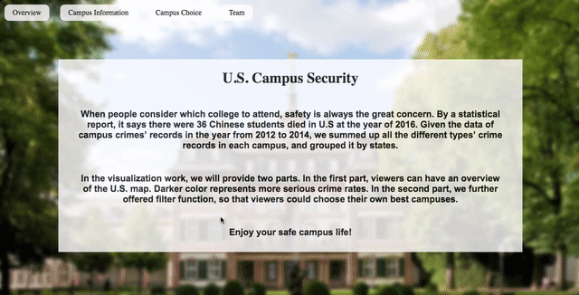

# Description of the Project

## Team
- Zhanfeng Huang
- Qiankun Li
- Yujun Tian

## Link
Project Website: https://danielwwong.github.io/DataVisFinal/

## Overview

We created a website for students to choose campus based on the states' overall campus crime rates. With vivid data visualization, hopefully, our website would be a guidance for the students.

The overview of our map is an U.S. map, surrounded by many bar charts. The US states map are marked by color code, when the states are marked by darker color, it means that the states are less safe than states with light color. When viewers mouse over specific state, the corresponding state would be highlighted. If viewers further click it, the map would shrink and detail information about the state would show by bar charts below.

The bar charts will draw all the states information as an x axis, and if viewers hover the mouse over specific state in the map, the corresponding bar would be highlighted. The bar charts would cover information including gender rate, number of crime and schools’ attributes. But now, we have just plot gender rate information on the bar chart.

## Code and Data

Code: index.html is our website's page, also we used states.json

Library: states.json, crimeDevidedByStates.csv

Code: index.html

File "states.json" provides us with states’ coordinates, the "index.html" belongs to our code. And "crimeDevidedByStates.csv" provides the data.

## Non-obvious Features of Our Interface

We still have some features which are not completed yet. We planned to add another part, which can provide us with several filters. The filter contains gender rate, years, whether the school is private or public, how many years the school offers, states choice. Once the user has made his choice, the US city map would map top 5 safest and top 5 dangerous schools’ place on the US map.

##References
